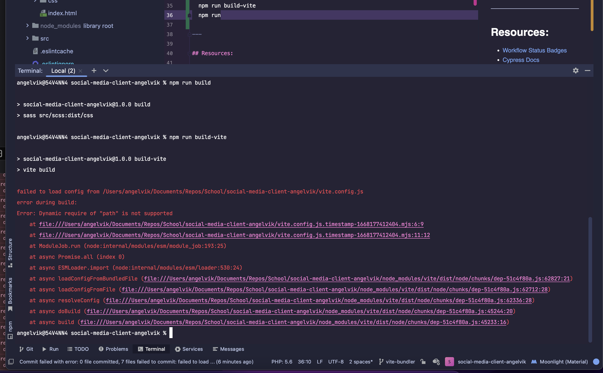
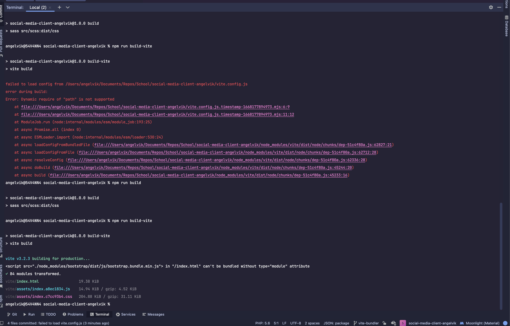
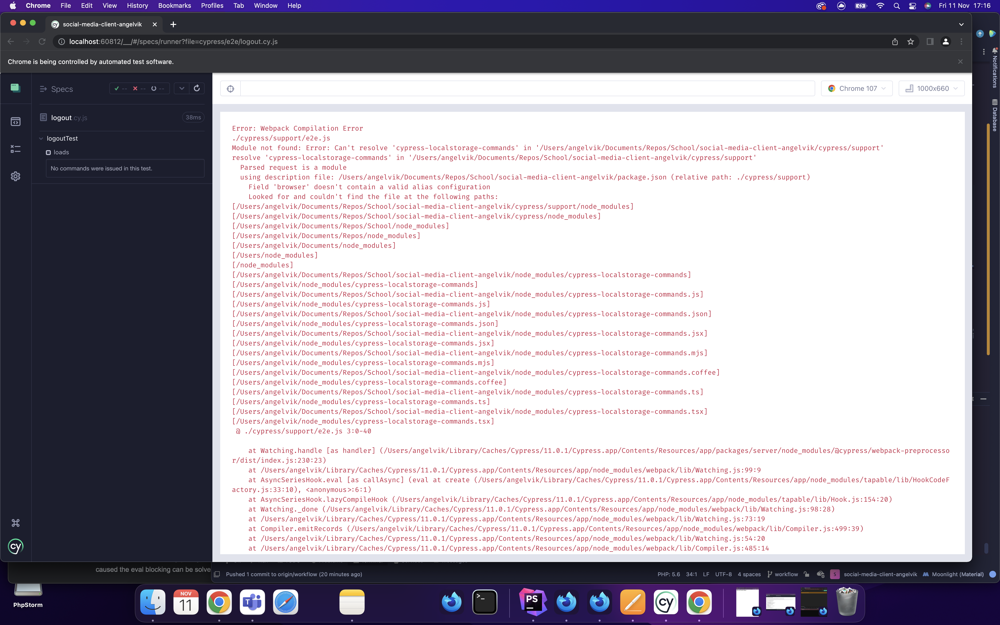
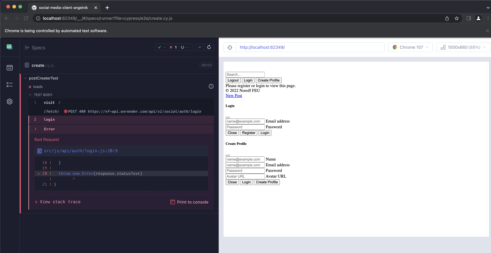
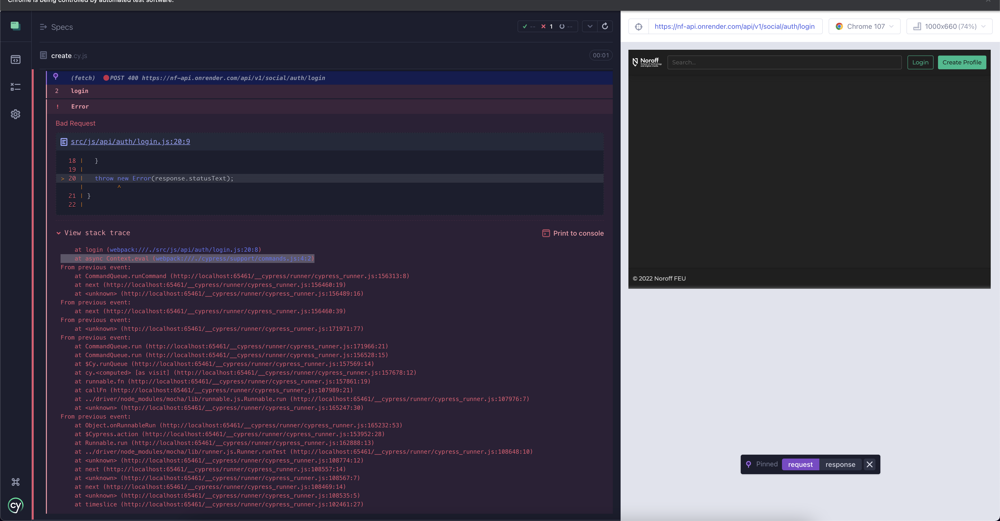
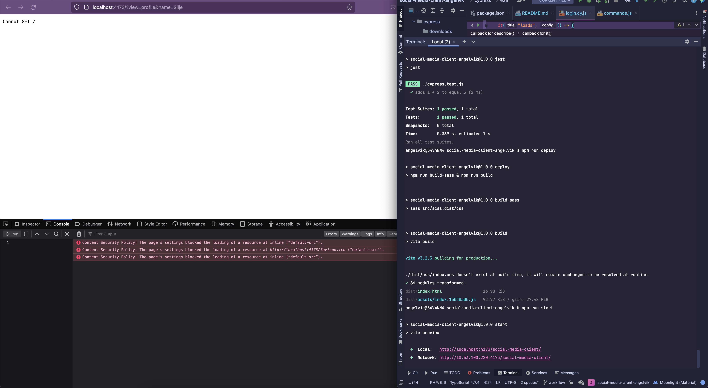
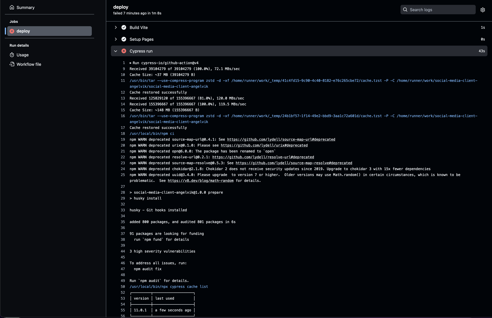

# Workflows Course Assignment

  
[](https://app.netlify.com/sites/social-media-client-ca-angelvik/deploys)

**Student:** [Silje Angelvik](https://github.com/siljeangelvik)  
**Host:** [Netlify](https://social-media-client-ca-angelvik.netlify.app/)  
**Repository:** [GitHub](https://github.com/siljeangelvik/social-media-client-angelvik/tree/workflow)  
**GitHub Pages:** [Live Domain](https://siljeangelvik.github.io/social-media-client-angelvik/)

| Resources | URLs                                                                  |
| :-------- | :-------------------------------------------------------------------- |
| Brief     | [CA Brief](https://noroff-content.gitlab.io/feu/workflow/ca.html)     |
| Forked    | [NoroffFEU Project](https://github.com/NoroffFEU/social-media-client) |

## Social Media Client

### Description

This is a social media client built with Vite, SASS, Bootstrap, Cypress, Jest, ESLint, Prettier, and GitHub Actions.

## Built with

- [HTML](https://developer.mozilla.org/en-US/docs/Web/HTML)
- [CSS](https://developer.mozilla.org/en-US/docs/Web/CSS)
- [Bootstrap](https://getbootstrap.com/)
- [Cypress](https://www.cypress.io/)
- [Jest](https://jestjs.io/)
- [ESLint](https://eslint.org/)
- [Prettier](https://prettier.io/)
- [GitHub Actions](https://docs.github.com/en/actions)
- [JavaScript](https://developer.mozilla.org/en-US/docs/Web/JavaScript)
- [SASS](https://sass-lang.com/)
- [Git](https://training.github.com/downloads/github-git-cheat-sheet/)
- [GitHub](https://github.com/about)
- [Vite](https://vitejs.dev/)
- [Netlify](https://www.netlify.com/)
- [PhpStorm](https://www.jetbrains.com/phpstorm/)

## Getting started

### Installing

1. Clone the repo:

```bash
git clone git@github.com:siljeangelvik/social-media-client.git
```

2. Install the dependencies:

```
npm install
```

### Running

To run the app in development mode:

```bash
npm run dev
```

To build the app:

```bash
npm run build
```

To preview the app:

```bash
npm run preview
```

## Contributing

No contributions at this time.

## Contact

Click on the badges below to go to my profiles or contact me via email.

<a href = "https://www.linkedin.com/in/siljeangelvik/">
    
</a>
<a href = "https://github.com/siljeangelvik">
    
</a>
<a href = "mailto: angelviksilje@gmail.com">
    
</a>

## Acknowledgments

### Resources

- [Workflow Status Badges](https://docs.github.com/en/actions/monitoring-and-troubleshooting-workflows/adding-a-workflow-status-badge)
- [Cypress Docs](https://docs.cypress.io/guides/overview/why-cypress)
- [Prettier Pre-Commit Hook](https://prettier.io/docs/en/precommit.html)
- [npm commands](https://docs.npmjs.com/cli/v7/commands)
- [ESLint JavaScript](https://eslint.org/docs/latest/developer-guide/working-with-rules)
- [Simple SASS Compiler Setup](https://sprucecss.com/blog/the-simplest-sass-compile-setup)
- [Vite Docs Guide](https://vitejs.dev/guide/)
- [Git Docs WebHook](https://docs.github.com/en/get-started/customizing-your-github-workflow/exploring-integrations/about-webhooks)
- [Asbjørn GitHub Repo](https://github.com/Thundeee/social-media-client/tree/workflow)
- [Cypress Login Tests](https://www.dolthub.com/blog/2020-10-23-cypress-login-tests/)

- **Bundler:** Vite
- **Formatter:** Prettier
- **Linting:** ESLint
- **Unit Tester:** Jest / Cypress
- **E2E Tester:** Cypress

---

### Issues

Feedback when running commands:  
`npm run dev`  
`npm run build`



#### Trying to fix issue:

**SOLVED:** removed `"type": "module"` from package.json.  
`npm run build` = successful



Additional Feedback:  
script src=./node_modules/bootstrap/dist/js/bootstrap.bundle.min.js  
in index cannot be bundled without type=module attribute

script src=./src/js/index.js  
in index cannot be bundled without type=module attribute

**SOLVED:** adding type=module to script-link in html.

##### Cypress



###### Trying to fix issue:

Installing npm package:  
[cypress-localstorage-commands](https://www.npmjs.com/package/cypress-localstorage-commands)

##### Running Cypress again:

##### Cypress works, but throwing errors:

**400:** api/v1/social/auth/login  
**404:** src/js/storage/index  
**404:** dist/css/index.css



##### Running Cypress again:

##### Trying to fix issue:

**400:** api/v1/social/auth/login  
**404:** src/js/storage/index  
~~**404:** dist/css/index.css~~ **SOLVED**

`npm run cypress `

at login (webpack:///./src/js/api/auth/login.js:20:8)
at async Context.eval (webpack:///./cypress/support/commands.js:4:2)

##### Scripts

`npm run deploy`  
./dist/css/index.css doesn't exist at build time, it will remain unchanged to be resolved at runtime



##### GitHub Actions

deprecated npm packages:  
[source-map-url](https://github.com/lydell/source-map-url#deprecated)



##### Cypress

2 out of 3 cypress tests pass.

#### CSS Styling

Styling does not get applied to the website after deployed for some reason.

I am guessing its because

#### In package.json

**Old:**  
"build": "sass src/scss:dist/css & vite build",  
"start": "vite preview",

**New:**  
"build": "sass src/scss:dist/css",  
"start": "sass --watch src/scss:dist/css & live-server",
